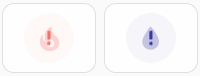

# 💫 Auto-Animations for [Mushroomic Icons](https://github.com/Maetzi87/mushroomic-icons)

Some **Mushroomic Icons** include built‑in automatic animations when used inside **Mushroomic Power Card**. 
Icons marked as **Colorable** allow customizing the animation color via `animation_color`. 
Icons with **Badge** also show animation when used in badge.

## 📺 Screen Animation

| Icons                                                           | Colorable             | Badge | Disable animation |
|-----------------------------------------------------------------|-----------------------|----------------|-------------------|
| - mushic:cellphone  - mushic:laptop  - mushic:monitor  - mushic:tablet  - mushic:television  - mushic:television-classic | ✔ | ❌ | `icon_animation: none` |

[**Screen animation code examples** →](examples/auto-animations/examples.md#screen-animation)

---

## ❗ Alert Animations

| Animation | Icons                                                           | Colorable             | Badge | Disable animation |
| --------- |-----------------------------------------------------------------|-----------------------|---------------- |-------------------|
|  | - mushic:fire  - mushic:water  | ✔  | ✔  (without overlay icon) | <pre>icon_animation: none  shape_animation: none  overlay_icon: none  overlay_animation: none</pre> |
|  | mushic:bell-ring  | ✔  | ✔ | `icon_animation: none` |
|  | mushic:door  | ✔  | ✔ | `icon_animation: none` |

[**Alert animations code examples** →](examples/auto-animations/examples.md#alert-animations)

