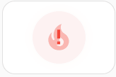
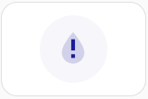
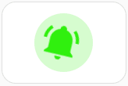
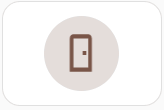

# 💫 Auto-Animations for [Mushroomic Icons](https://github.com/Maetzi87/mushroomic-icons)

Some **Mushroomic Icons** include built‑in automatic animations when used inside **Mushroomic Power Card**. 
Icons marked as **Colorable** allow customizing the animation color via `animation_color`. 
Icons with a ✔ at **Badge** also show animation when used in badge.

## 📺 Screen Animation

| Icons                                                           | Colorable             | Badge | Disable animation |
|-----------------------------------------------------------------|-----------------------|----------------|-------------------|
| - mushic:cellphone  - mushic:laptop  - mushic:monitor  - mushic:tablet  - mushic:television  - mushic:television-classic | ✔ | ❌ | `icon_animation: none` |

[**Screen animation code examples** →](examples/auto-animations/examples.md#screen-animation)

---

## ⏰ Alert Animations

Alert animations **work out of the box** if the Mushroomic Icon is used - you **don't need additional code**.  
 
The "Code behind Auto-Animation" is provided for **customization** and/or to apply the animation to different icons.  
**Badges** use `badge_icon_animation` (≙ `icon_animation`), `badge_animation` (≙ `shape_animation`) and `badge_icon_origin` (≙ `icon_origin`).
Badges do not support overlay icons.

| Animation | Icons                                                           | Colorable             | Badge | Disable animation | Code behind Auto-Animation |
| --------- |-----------------------------------------------------------------|-----------------------|---------------- |-------------------| ---|
|   | - mushic:fire  - mushic:water  | ✔  | ✔ | <pre>icon_animation: none  shape_animation: none  overlay_icon: none  overlay_animation: none</pre> | <pre>icon_animation: "mushic-blink 1.5s ease-in-out infinite"  shape_animation: "mushic-ping 1.5s infinite, mushic-blink 1.5s ease-in-out infinite"  overlay_icon: mushic:alert  overlay_animation: "mushic-blink 1.5s ease-in-out infinite -750ms"</pre> |
|  | - mushic:alert-circle | ❌  | ✔ | <pre>icon_animation: none  shape_animation: none </pre> | <pre>icon_animation: "mushic-blink 1.5s ease-in-out infinite"  shape_animation: "mushic-blink 1.5s ease-in-out infinite" </pre> |
|  | mushic:bell-ring  | ❌ | ✔ | <pre>icon_animation: none</pre> | <pre>icon_animation: "mushic-ring 4s linear infinite" icon_origin: "50% 15%"</pre> |
|  | mushic:door  | ❌  | ✔ | <pre>icon_animation: none</pre> | <pre>icon_animation: "mushic-ring 4s linear infinite"  icon_origin: "50% 15%"</pre> |

[**Alert animations code examples** →](examples/auto-animations/examples.md#alert-animations)

