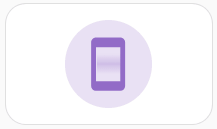
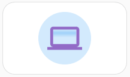
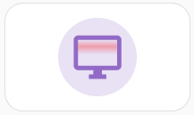

# Auto-Animations for [Mushroomic Icons](https://github.com/Maetzi87/mushroomic-icons)

Several Mushroomic Icons bring automatic animations if used in Mushroomic Power Card.  
For those labeled with **Colorable** the animation color can be customized using `animation_color`.

## Screen Animation

| Icons                                              | Colorable               | Disable animation |
|-----------------------------------------------------------------|-----------------------|--------------|
| - mushic:cellphone  - mushic:laptop   - mushic:monitor  - mushic:tablet  - mushic:television  - mushic:television-classic | ✔ | `icon_animation: none` |

 
Examples for screen animation 

  
| Animation Preview                                               | Icon               | Example code |
|-----------------------------------------------------------------|--------------------|--------------|
|      | `mushic:cellphone` | <pre>type: custom:mushroomic-power-card icon: mushic:cellphone color: purple vertical: true icon_tap_action:   action: more-info</pre> |
|            | `mushic:laptop`    | <pre>type: custom:mushroomic-power-card icon: mushic:laptop color: purple shape_color: blue vertical: true icon_tap_action:   action: more-info</pre> |
|            | `mushic:monitor`    | <pre>type: custom:mushroomic-power-card icon: mushic:monitor color: purple animation_color: red vertical: true icon_tap_action:   action: more-info</pre> |
|            | `mushic:tablet`    | <pre>type: custom:mushroomic-power-card icon: mushic:tablet color: purple shape_color: yellow animation_color: black vertical: true icon_tap_action:   action: more-info</pre> |
|    | `mushic:television` | <pre>type: custom:mushroomic-power-card icon: mushic:television color: purple shape_color: turquoise animation_color: var(--mushic-icon-color) vertical: true icon_tap_action:   action: more-info</pre> |
|  | `mushic:television-classic` | <pre>type: custom:mushroomic-power-card icon: mushic:television-classic color: purple vertical: true icon_tap_action:   action: more-info</pre> |

